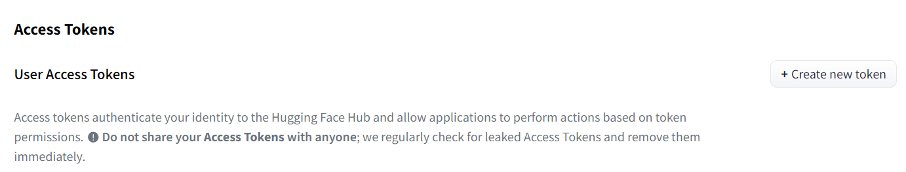
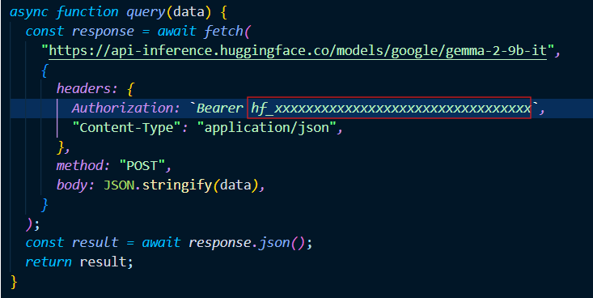
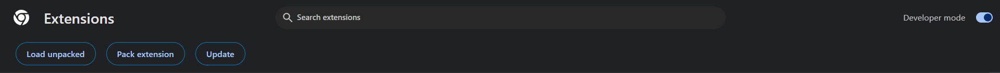

# DetoxiTube

Detoxitube is a browser extension designed to enhance focus by blurring all YouTube videos except those matching specific user-defined keywords. By filtering out irrelevant content, Detoxitube ensures a distraction-free browsing experience tailored to your interests.

## How to load the extension

1. Create new [huggingface access token](https://huggingface.co/google/gemma-2-9b-it).



2. Copy it and paste it here



3. Load unpacked the extension folder



4. Open [youtube](https://www.youtube.com/)

## How to Contribute to this repository

#### Before contributing create an issue of the bug or a feature you would like to add in the project and get the task assigned for yourself.

1. Star the repository.
2. Fork the repository. (Click the Fork button in the top right of this page, click your Profile Image)
3. Clone the forked repository to your local machine.

```markdown
git clone https://github.com/your-username/AnimeHub.git
```

4. Change the present working directory.

```markdown
cd detoxitube
```

5. Make a new branch

```markdown
git checkout -b branch-name
```

6. Make change in the repository with the new branch.

7. Push the changes.

```markdown
git add .
git commit -m "Your commit Message"
git push origin branch-name
```

8. Make a pull request on Github.

### Happy distraction free journey! 🍿